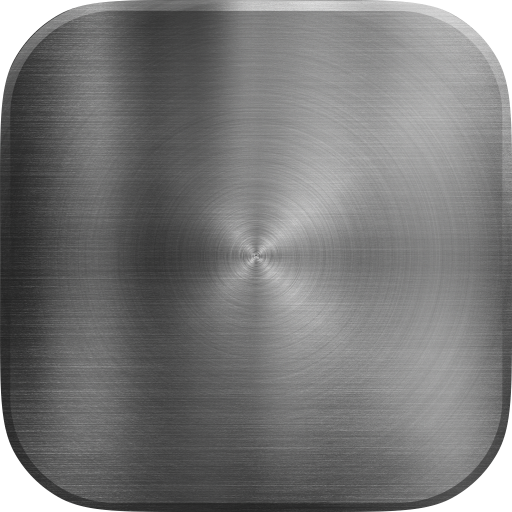

<div align="center">
  <a href="https://github.com/brandonkthomas/Indium">
    
  </a>

  <h3 align="center">Indium</h3>

  <p align="center">
    Customizable UI kit: TypeScript, CSS, and Razor templates with full-shell and per-component bundles
    <br />
    <br />
    <a href="https://dotnet.microsoft.com/en-us/apps/aspnet"></a>
    <a href="https://learn.microsoft.com/en-us/aspnet/core/razor-pages"></a>
    <a href="https://www.typescriptlang.org"></a>
    <a href="https://www.w3.org/Style/CSS/Overview.en.html"></a>
  </p>
</div>

## About the Project
Indium is a reusable UI-core package for host applications that need a consistent shell, component library, and static asset contract.

It ships as a Razor Class Library with both static web assets and JS/CSS bundles for both full-shell usage + optional component-level usage.

### Feature Highlights
- **Full Shell Boot**: `bootIndium(...)` for app-root wiring, sidebar behavior, branding, and runtime layout contracts.
- **Optional Components**: Dialogs, glass surface, infinite scroll, sidebar, grad-noise canvas, and navbar can be consumed independently.
- **Config + Path Helpers**: `setIndiumConfig(...)`, `routePath(...)`, `apiPath(...)`, and `assetPath(...)`.
- **Host-Compatible Navbar**: Canonical `wa-navbar*` selectors with legacy `url-*` compatibility support.
- **Runtime Test Coverage**: Browser-executed UI contract tests via Portfolio host route `/internal/indium/tests`.

## Getting Started
```bash
npm install
npm run check
npm run build
dotnet build Indium.csproj /v:minimal
```

## API
- `bootIndium()` (full-shell bootstrap + layout/sidebar/branding contracts)
- `createNavbarController()`
- `createSidebarController()`
- `attachInfiniteScroll()`
- `showAlert()`, `showConfirm()`, `showPrompt()` (dialogs)
- `createGlassSurface()`
- `createGradNoiseCanvas()`
- `routePath()`, `apiPath()`, `assetPath()`, `setIndiumConfig()`

## Build Outputs
- Full bundle:
  - `build/indium.js`
  - `build/indium.css`
- Component JS bundles:
  - `build/components/dialogs.js`
  - `build/components/glassSurface.js`
  - `build/components/infiniteScroll.js`
  - `build/components/sidebar.js`
  - `build/components/gradNoiseCanvas.js`
  - `build/components/navbar.js`
- Component CSS bundles:
  - `build/components/dialogs.css`
  - `build/components/glassSurface.css`
  - `build/components/infiniteScroll.css`
  - `build/components/sidebar.css`
  - `build/components/cards.css`
  - `build/components/navbar.css`
  - `build/components/shell.css`
